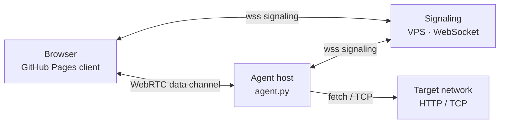
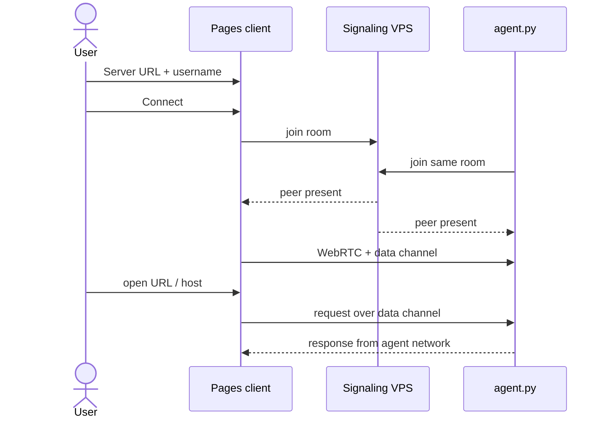

# WebRTC P2P TCP Proxy

**Live client:** [https://abproductionit.github.io/P2P_Network/](https://abproductionit.github.io/P2P_Network/)

Browse the internet (or a LAN) through another machine over **WebRTC**. The static browser client runs on GitHub Pages; a small Python **signaling server** and **agent** run on a VPS / host you control. Application traffic goes peer-to-peer; the WebSocket server is signaling only.

## Architecture

Browser (Pages) ↔ signaling (VPS) ↔ agent host; HTTP/TCP then rides a WebRTC data channel.



## Connect flow

Enter the signaling URL and a shared username, connect, then browse through the agent.



## Run on a VPS

```bash
git clone https://github.com/ABproductionIT/P2P_Network.git
cd P2P_Network
python3 -m venv .venv
source .venv/bin/activate
pip install -r requirements.txt
```

**Signaling** (defaults `0.0.0.0:9000`):

```bash
python signaling_server.py
# or: python signaling_server.py --host 0.0.0.0 --port 9000
```

Open the firewall for that port. From the **HTTPS** Pages client you need TLS in front of the process (nginx/Caddy) and a **`wss://your-domain`** URL — plain `ws://` only works when the page itself is HTTP.

**Agent** (on the machine whose network you expose; same username the client will use):

```bash
python agent.py --signaling wss://your-domain --username alice
```

**Client:** open the [live page](https://abproductionit.github.io/P2P_Network/), enter `wss://your-domain` and `alice`, click **Connect**, then browse.

Prototype only — do not expose the agent to untrusted users without auth and destination limits.
