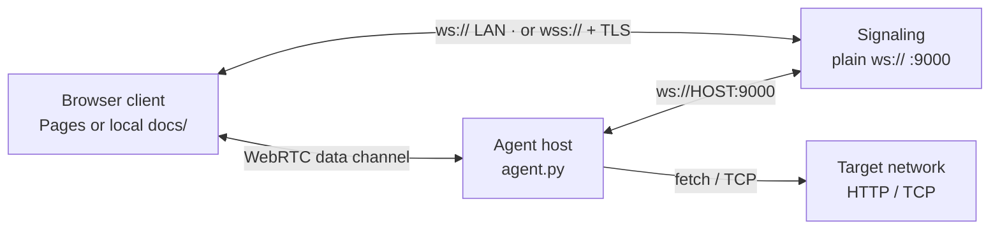
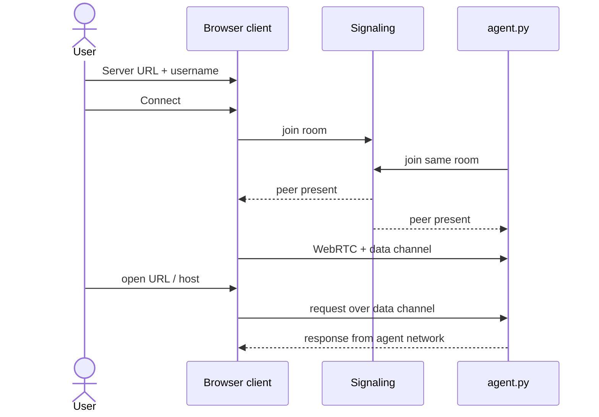

# WebRTC P2P TCP Proxy

**Live client:** [https://abproductionit.github.io/P2P_Network/](https://abproductionit.github.io/P2P_Network/)

Browse the internet (or a LAN) through another machine over **WebRTC**. The static browser client runs on GitHub Pages; a small Python **signaling server** and **agent** run on a VPS / host you control. Application traffic goes peer-to-peer; the WebSocket server is signaling only.

## Architecture

Browser ↔ signaling ↔ agent; HTTP/TCP then rides a WebRTC data channel.



## Connect flow

Enter the signaling URL and a shared username, connect, then browse through the agent.



## Signaling URL rules (read this)

| What you type | Result |
|---------------|--------|
| `ws://10.10.1.97:9000` | Correct for bare `signaling_server.py` (no TLS) |
| `10.10.1.97:9000` | Normalized to `ws://…` (agent) |
| `wss://10.10.1.97:9000` | Fails unless TLS is in front — agent retries `ws://` once |
| `0.0.0.0:9000` / `wss://0.0.0.0:9000` | **Rejected** — bind address only; use `127.0.0.1` or your LAN IP |

- **Agent CLI** can always use plain `ws://` (recommended for local/VPS without certs).
- **GitHub Pages client is HTTPS** — browsers block mixed-content `ws://`. For Pages you need TLS (nginx/Caddy) + `wss://`, **or** open `docs/index.html` via a local `http://` server and use `ws://`.

## Run on a VPS (no sudo)

Uses **[uv](https://docs.astral.sh/uv/)** in user space — do **not** use `python3 -m venv` (breaks on Python 3.14 without `ensurepip` / without apt).

```bash
# one-time: install uv (user space)
curl -LsSf https://astral.sh/uv/install.sh | sh
source "$HOME/.local/bin/env"

git clone https://github.com/ABproductionIT/P2P_Network.git
cd P2P_Network
./scripts/setup.sh
# or: uv venv .venv && uv pip install -r requirements.txt --python .venv/bin/python
```

### Run in a terminal (foreground — watch the logs)

Start signaling and the agent **in a normal terminal session**, in the **foreground**. Logs go to that terminal’s **stdout/stderr**. Press **Ctrl+C** in the same terminal to stop. Do **not** use `nohup`, `&`, `systemd`, `screen`/`tmux` detach, or other backgrounding if you want to see the logs there.

**Signaling** (binds `0.0.0.0:9000` — no root) — leave this terminal open:

```bash
./scripts/run-signaling.sh
# or: .venv/bin/python signaling_server.py --host 0.0.0.0 --port 9000
```

Startup logs print connect URLs like `ws://127.0.0.1:9000` and `ws://<LAN-IP>:9000`. Open the firewall for that port if peers are remote.

**Agent** (separate terminal on the machine whose network you expose; same username the client will use) — leave this terminal open too:

```bash
# LAN / no TLS (typical):
.venv/bin/python agent.py --signaling ws://10.10.1.97:9000 --username alice
# same machine as signaling:
.venv/bin/python agent.py --signaling ws://127.0.0.1:9000 --username alice
```

**Client options:**

1. **Local HTTP** (plain `ws://` works): serve `docs/` over HTTP and enter `ws://10.10.1.97:9000` + `alice`.
2. **GitHub Pages** (HTTPS): put TLS in front of `:9000`, then enter `wss://your-domain` + `alice` on the [live page](https://abproductionit.github.io/P2P_Network/).

Prototype only — do not expose the agent to untrusted users without auth and destination limits.
